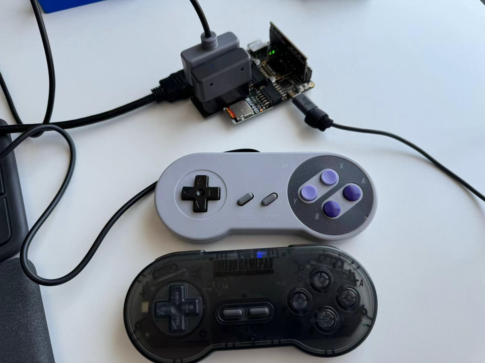
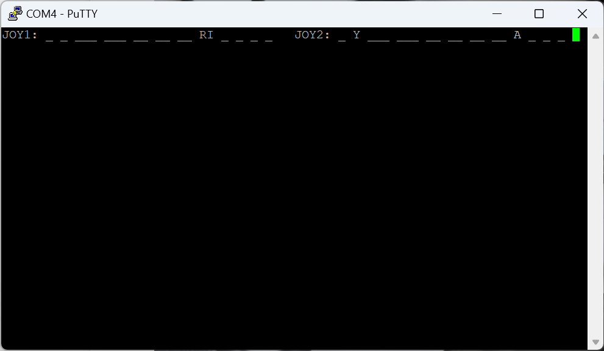

# Reading SNES controller on a FPGA

This is a quick demo of reading the SNES controller with Verilog, done on Sipeed Primer 25K.

This is the wiring:

```
                          

       ----------------------------- ---------------------
      |                             |                      \
      | (1)     (2)     (3)     (4) |   (5)     (6)     (7) |   SNES Controller
      |  5V     clock   latch   data|                   GND/
       --|-------|-------|-------|-- --------------------|
         |        \       \       \                      |
         |       ,-\-------\-------\---------------------'
         |       |  \       \       \
         |       |   -----.  ------.  ------.
       --|-------|--------|--------|--------|---------------
      |  |       |        |        |        |               |
      | (VCC)   (GND)   (pin3)   (pin2)   (pin1)   (pin0)   |   
      |                                                     |   PMOD
      | (VCC)   (GND)   (pin7)   (pin6)   (pin5)   (pin4)   |   
      |                                                     |
       -----------------------------------------------------

```

Connection through pmod:



Result from UART:



Reference
* [Pinouts & Protocol FAQ (SNES) by JChristy](https://gamefaqs.gamespot.com/snes/916396-super-nintendo/faqs/5395)

## Usage

Connect Putty to COM port of Primer 25K with baud rate 115200. You can find out which COM port with Windows Device Manager.

Program `snes_controller.fs` to Primer 25K to see the results on Putty.

